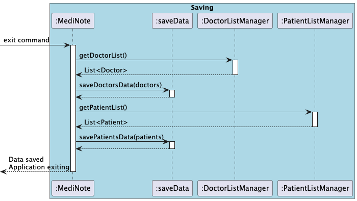

# Developer Guide

## Acknowledgements

{list here sources of all reused/adapted ideas, code, documentation, and third-party libraries -- include links to the original source as well}

## Setting up, getting started
Refer to the guide

## Design
### Architecture
#### Storage component

## Implementation

## Application Startup Process (Loading Data)

This sequence diagram illustrates the steps executed when the application is launched. The **MediNote** application ensures the necessary data files exist, loads doctor and patient data, and prepares the application for user input.

1. **File Existence Check:**
    - `MediNote` calls `ensureDoctorsFileExists()` and `ensurePatientsFileExists()` to confirm the presence of required storage files.

2. **Doctor Data Loading:**
    - The `loadDoctorData()` method is called from `loadData`, returning a `List<Doctor>`.
    - The retrieved doctor list is then added to `DoctorListManager` using `addAll(doctors)`.

3. **Patient Data Loading:**
    - The `loadPatientData()` method is called from `loadData`, returning a `List<Patient>`.
    - The retrieved patient list is then added to `PatientListManager` using `addAll(patients)`.

4. **Application Readiness:**
    - Once all necessary data is loaded, the application signals readiness for user input.

---

## Application Shutdown Process (Saving Data)

This sequence diagram describes the data-saving process when the application exits. Upon receiving an exit command, the system saves the doctor and patient data before shutting down.

1. **Doctor Data Retrieval & Saving:**
    - `MediNote` calls `getDoctorList()` on `DoctorListManager` to obtain the list of doctors.
    - The retrieved doctor list is passed to `saveDoctorsData(doctors)`, ensuring it is stored persistently.

2. **Patient Data Retrieval & Saving:**
    - `MediNote` calls `getPatientList()` on `PatientListManager` to obtain the list of patients.
    - The retrieved patient list is passed to `savePatientsData(patients)`, ensuring it is stored persistently.

3. **Application Shutdown:**
    - Once all data is saved, the application exits gracefully.

---

## Product scope
### Target user profile

{Describe the target user profile}

### Value proposition

{Describe the value proposition: what problem does it solve?}

## User Stories

|Version| As a ... | I want to ... | So that I can ...|
|--------|----------|---------------|------------------|
|v1.0|new user|see usage instructions|refer to them when I forget how to use the application|
|v2.0|user|find a to-do item by name|locate a to-do without having to go through the entire list|

## Non-Functional Requirements

{Give non-functional requirements}

## Glossary

* *glossary item* - Definition

## Instructions for manual testing

{Give instructions on how to do a manual product testing e.g., how to load sample data to be used for testing}
