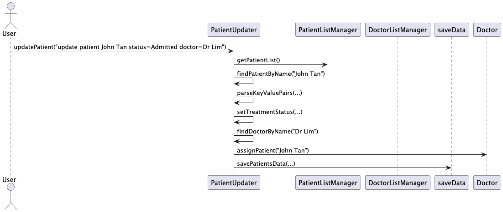
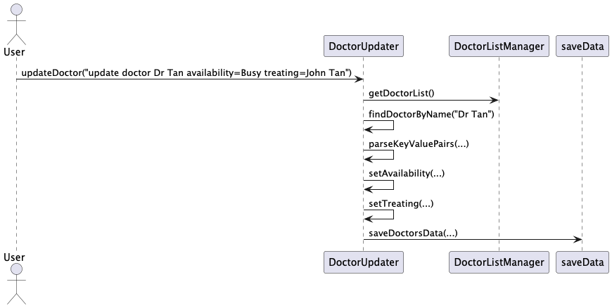

# Developer Guide

## Acknowledgements
CS2113 Teaching Team


## Setting up, getting started

### Setting up the project in your computer

#### Setting up

---------------------------------------------------------------------------------------------
| Tool                | Recommended Version Notes   | Notes                                   
|---------------------|-----------------------------|----------------------------------------
| Java JDK            | 17 or higher                | Required for compiling and running
| IntelliJ IDEA       | 2021.2+                     | Preferred IDE for full Java support
| JUnit 5             | 5.x                         | For running the test suite
| Git                 | Latest                      | For version control and collaboration   
| Gradle              | Latest                      | For dependency and build management     


#### Getting started

1. **Fork this [repo](https://github.com/AY2425S2-CS2113-T12-1/tp.git)**
2. **Clone the fork into your computer**
3. **If you plan to use Intellij IDEA (highly recommended):**
   - ***Configure the JDK:*** Follow the guide 
   [[se-edu/guides] IDEA: Configuring the JDK](https://se-education.org/guides/tutorials/intellijJdk.html) 
   to ensure Intellij is configured to use JDK 17.
   - ***Import the project as a Gradle project:*** Follow the guide 
   [[se-edu/guides] IDEA: Importing a Gradle project](https://se-education.org/guides/tutorials/intellijImportGradleProject.html)
   to import the project into IDEA.

   **! Note: Importing a Gradle project is slightly different from importing a normal Java project.**

   - ***Verify the setup:***
        Run the `MediNote` and try a few commands.
        Run the tests to ensure they all pass.

#### Before writing code

1. **Configuring the coding style**
   -If using IDEA, follow the guide [[se-edu/guides] IDEA: Configuring the code style](https://se-education.org/guides/tutorials/intellijCodeStyle.html)
   to set up IDEA’s coding style to match ours.
2. **Set up CI**
   -This project comes with a GitHub Actions config files (in `.github/workflows` folder). 
When GitHub detects those files, it will run the CI for your project automatically
at each push to the `master` branch or to any PR. No set up required.
3. **Learn the design**
   -When you are ready to start coding, we recommend that you get some sense
of the overall design by reading about ***MediNote’s*** architecture.

## Design & implementation

### Overall Architecture

  
This Architecture Diagram represents the high-level design of MediNote.  

### Main Components of Architecture

Main consists of the _MediNote_ class which is in charge of startup and shutting down.  
- At launch, if a save file exists, it will load all patient and doctor information into MediNote.  

In an overview, most work is done by these components:
- **Main**: Reads user input.
- **Storage**: Loads and writes information as MediNote is running.
- **Manager**: Handles overall patient, doctor information and command calls.  
- **Commands**: Executes commands.
- **Ui**: Prints to user *(Currently only help command)*.

<b> How the architecture components interact with each other</b><br>

The <i>Sequence Diagram</i> below shows how the components interact with each other for the scenario where the user issues the command `register John Pork/High Fever/5 Jan 2025 1730/Cheese allergy`


Each of the main components are separated into functional packages with concrete classes that handle specific responsibilities.

For example, the Manager component contains a TaskManager.java class that parses the input and delegates execution to the respective functions. <br>

In the context of this example:

| Package  | Key Classes     | Responsibilities                                                      |
|----------|-----------------|-----------------------------------------------------------------------|
| main     | MediNote        | Receives raw user input and initialises the command flow              |
| manager  | TaskManager     | Parses inputs and delegates execution to the respective command class |
| commands | RegisterPatient | Contains bulk of code logic                                           |
| storage  | SaveData        | Persists data to text files                                           |

### Management of Tracked Doctors

The `DoctorListManager` class main purpose is to maintain `ArrayList<Doctor> doctorList`, 
which keeps track of the doctors currently working in the hospital.<br>
This class also contains methods that directly modifies the state of `doctorList`.<br>

1. **Adding New Doctors:**
    - `DoctorListManager` contains `addDoctor()` which is called by the `RegisterDoctor` class.
    - `addDoctor()` takes in one `Doctor` type and adds it to `doctorList`.

2. **Removing Existing Doctors:**
    - `DoctorListManager` contains `removeDoctor()` which is called by `DeleteDoctor` class.
    - `removeDoctor()` takes in one `Doctor` type removes it from `doctorList`.
    - It then searches `patientList` and removes the doctor from all patients' `doctorAssigned` attribute.

3. **Listing Existing Doctors:**
    - `DoctorListManager` contains `listDoctors()` which is called by `TaskManager` class.
    - It then calls the `DoctorLister` class which contains the printing logic.

The <i>Sequence Diagram</i> below shows how the components interact with each other for the scenario where the user
 issues the command `list doctor`


### Application Startup Process (Loading Data)

This sequence diagram illustrates the steps executed when the application is launched.
The **MediNote** application ensures the necessary data files exist,
loads doctor and patient data, and prepares the application for user input.

1. **File Existence Check:**
    - `MediNote` calls `ensureDoctorsFileExists()` and `ensurePatientsFileExists()` to confirm the presence of required storage files.

2. **Doctor Data Loading:**
    - The `loadDoctorData()` method is called from `loadData`, returning a `List<Doctor>`.
    - The retrieved doctor list is then added to `DoctorListManager` using `addAll(doctors)`.

3. **Patient Data Loading:**
    - The `loadPatientData()` method is called from `loadData`, returning a `List<Patient>`.
    - The retrieved patient list is then added to `PatientListManager` using `addAll(patients)`.

4. **Application Readiness:**
    - Once all necessary data is loaded, the application signals readiness for user input.


### Application Shutdown Process (Saving Data)

This sequence diagram describes the data-saving process when the application exits. Upon receiving an exit command, the system saves the doctor and patient data before shutting down.

1. **Doctor Data Retrieval & Saving:**
    - `MediNote` calls `getDoctorList()` on `DoctorListManager` to obtain the list of doctors.
    - The retrieved doctor list is passed to `saveDoctorsData(doctors)`, ensuring it is stored persistently.

2. **Patient Data Retrieval & Saving:**
    - `MediNote` calls `getPatientList()` on `PatientListManager` to obtain the list of patients.
    - The retrieved patient list is passed to `savePatientsData(patients)`, ensuring it is stored persistently.

3. **Application Shutdown:**
    - Once all data is saved, the application exits gracefully.


## Product scope
### Target user profile

The target users are hospital management staff.
MediNote provides a way to compile the list of patients and which patients the doctors are assigned to, and has features to help edit and keep track of changes in the hospital.


### Value proposition

MediNote provides a way to easily track and edit patient and doctor assignments in the hospital.
MediNote aims to improve the management capacity and efficiency of hospitals.

##  PatientUpdater

The `PatientUpdater` class allows users to dynamically update a patient's information through CLI input. It accepts multiple key-value fields and ensures consistency by also updating the assigned doctor record if needed.

### Key Method:

#### `updatePatient(String input)`
Parses commands in the format:
```
update patient John Tan status=In-Progress doctor=Dr Lim
```
It extracts the patient name and fields to be updated. It then:

- Finds the patient from `PatientListManager`
- Updates the patient's `treatmentStatus` or `assignedDoctor`
- If a doctor is assigned, it also updates the doctor's record
- Changes are persisted using `saveData.savePatientsData(...)`

### Supporting Methods:
- `findPatientByName(...)`: Case-insensitive lookup of the target patient.
- `findDoctorByName(...)`: Used to fetch the doctor object for assignment.
- `parseKeyValuePairs(...)`: Parses dynamic field inputs into a `HashMap`.

## DoctorUpdater

The `DoctorUpdater` class allows the user to modify existing doctor records by updating their availability and current patients being treated.

### Key Method:

#### `updateDoctor(String input)`
Accepts input in this format:
```
update doctor Dr Tan availability=Busy treating=Mr A
```
It:

- Finds the doctor by name
- Updates their availability and patient-treatment fields
- Saves changes using `saveData.saveDoctorsData(...)`

### Supporting Methods:
- `findDoctorByName(...)`: Searches the global doctor list using a case-insensitive match.
- `parseKeyValuePairs(...)`: Validates and extracts field updates.

---

## ViewPatientAttributes

The `ViewPatientAttributes` class enables users to filter and view a specific attribute across all patients. This is useful for summarizing patient information quickly.

### Key Method:

#### `viewPatientAttribute(String input)`
Accepts the format:
```
view patient <attribute>
```

Supported attributes:

- `name`, `symptoms`, `timestamp`, `history`, `treatment`, `doctor`

For each patient, it prints the value of the selected field in a tabulated manner.

---

## ViewDoctorAttributes

This class provides a filtered view of selected attributes from all doctor records for quick summary inspection.

### Key Method:

#### `viewDoctorAttribute(String input)`
Accepts the format:
```
view doctor <attribute>
```

Supported attributes:

- `name`, `specialization`, `availability`, `treating`

For each doctor, it prints the requested attribute for easy comparison across doctors.

---
## DeleteDoctor
The `DeleteDoctor` class allows user to remove a doctor's information from the database as well as from their names
from their patient's information.

### Key Method:

#### `deleteDoctor(String docName)`
Parses command in the format: ```delete doctor Michael```

It:
- Looks for and finds the doctor's name in the doctor list
- Removes the doctor from the doctorList
- Removes the doctor's name from their patient's information, if they have any patients
- Saves changes using `saveData.saveDoctorsData(...)`
---
## DischargePatient
The `DischargePatient` class lets users discharge patients from the hospital and remove their information from 
the database. They are removed from the patient list as well as their doctor's information.

### Key Method:

#### `dischargePatient(String patientName)`
Parses command in the format: ```discharge patient Nathan```

It:
- Looks for and finds the patient's name in the patient list
- Removes patient from patientList
- Removes patient's name from their doctor's information
- Saves changes using `saveData.savePatientsData(...)`
---
## ViewDoctorFrequencies
The `ViewDoctorFrequencies` class lets users view the most visited type of doctor as well as the most visited doctor
by name. 

This sequence diagram is for the `viewMostFrequentSpecialisation()` function, which is described below.

### Key Methods:

#### `viewMostFrequentSpecialisation()`
Parses command in the format: ```popular doctor type```

It:
- Gets the list of doctors
- Goes through the list, getting the specialisation of each doctor while also adding to two lists
  - Unrepeated list of specialisations from the list of doctors
  - Corresponding list of counts for how many patients have been treated in that specialisation
- Finds highest count and prints the list of most visited specialisations
#### `viewMostFrequentDoctor()`
Parses command in the format: ```popular visited doctor```

It: 
- Gets the list of doctors
- Goes through the list, getting number of patients the doctor has treated and finding the max # treated
- Prints the doctor(s) with most patients treated and currently treating
---

## User Stories

| Version | As a ...              | I want to ...                                    | So that I can ...                                                 |
|---------|-----------------------|--------------------------------------------------|-------------------------------------------------------------------|
| v1.0    | Hospital receptionist | View medical history of patients                 | Inform the doctor about their past conditions                     |
| v1.0    | Hospital receptionist | View the list of commands available              | Easily navigate data                                              |
| v1.0    | Hospital receptionist | Be able to put in patient and doctor information | Start tracking new patient progress                               |
| v1.0    | Hospital receptionist | Update patient and doctor information            | Fix any mistakes and update records                               |
| v1.0    | Hospital receptionist | Delete patient or doctor records                 | Maintain accuracy and cleanliness of data                         |
| v2.0    | Hospital receptionist | View patient's information                       | So that I can inform the doctors                                  |
| v2.0    | Hospital receptionist | Update doctor availability                       | Inform the next patient for treatment                             |
| v2.0    | Hospital receptionist | See patient symptoms                             | Provide doctors with crucial information quickly                  |
| v2.0    | Hospital receptionist | View the status of patients                      | Check whether they have been discharged                           |
| v2.0    | Hospital receptionist | View the doctors that were visited the most      | Manage their assignments and work hours                           |
| v2.0    | Hospital receptionist | View the type of most frequently visited doctors | Hire more doctors of that specialisation for increased efficiency |

## Non-Functional Requirements

1. Should work on any <i>mainstream</i> OS as long as it has Java `17` or above installed.
2. Should be able to hold up to 1000 persons without a noticeable sluggishness in performance for typical usage.
3. A user with above average typing speed for regular English text (i.e. not code, not system admin commands) should be able to key in most of the records faster using commands than using the mouse.


## Glossary

* <b>Mainstream OS</b>: Windows, Linux, Unix, macOS

## Instructions for manual testing

### Download and Launch
1. Download the `.jar` file and copy into an empty folder.
2. Open the folder containing the `.jar` file and run terminal/command prompt.<br>
   On Windows, right-click the folder and select "Open in terminal".
3. Run `java -jar tP_V2p1.jar` in the command prompt/terminal.

### Available Commands to Test<br>
Refer to UserGuide for specific command syntax.
1. `help`: Lists all commands and their usage.
2. `register`: Register new patient.
3. `oncall`: Register new doctor.
4. `list patient`&`list doctor`: Lists all current patients and doctors.
5. `patient`: View specific patients.
6. `doctor`: View specific doctors.
7. `discharge patient`: Remove patient from system.
8. `delete doctor`: Remove doctor from system.
9. `update patient`: Update a patient's info.
10. `update doctor`: Update a doctor's info.
11. `view patient <ATTRIBUTE>`: View each patient's <ATTRIBUTE> individually.
12. `view doctor <ATTRIBUTE>`: View each doctor's <ATTRIBUTE> individually.
13. `list patient <ATTRIBUTE>`: List specific patient attribute across all.
14. `popular doctor type`: Show most common doctor specialisation. 
15. `popular visited doctor`: Show most visited doctor.
16. `stats`: Show hospital-wide metrics.
17. `exit`: Exit the program.

Note: These instructions provide a baseline explanation of the available commands. Testers should <br>
explore different usages and combinations of the commands during exploratory testing. 
